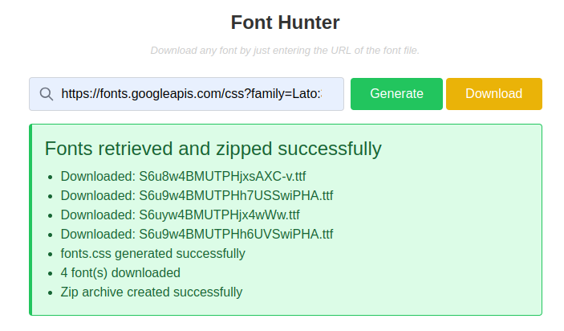

# Laravel Widget Package

A Laravel package for building and bundling reusable UI widgets as Blade components.

## Overview

`laravel-widget` is a Laravel package designed to manage a collection of UI widgets that can be easily embedded into any Laravel Blade view. The package simplifies widget integration while maintaining a clean, modern interface.

The package currently includes two widgets:
- **Font Hunter**: A utility to download Google Fonts and their CSS files via a simple form.
- **Avatar Widget**: A component to display an avatar image or generate a fallback avatar based on text initials.

---

## Features

- **Widget Bundle Ready**: Designed to host multiple widgets under one package.
- **Reusable Blade Components**: Easily embed widgets using Blade components.
- **Customizable Configurations**: Control storage paths, file names, and other settings for Font Hunter, and avatar appearance for the Avatar Widget.

---

## Requirements

- PHP 8.0 or higher
- Laravel 9.x or 10.x
- Writable storage directory (`storage/app/public`)
- GD PHP extension (for Avatar Widget image generation)

---

## Installation

1. **Install via Composer**

   If published to a repository:
   ```bash
   composer require souravmsh/laravel-widget
   ```

   If developing locally:
   ```bash
   // Add to composer.json
   "repositories": [
       {
           "type": "path",
           "url": "packages/souravmsh/laravel-widget"
       }
   ]
   composer require souravmsh/laravel-widget:dev-main
   ```

2. **Publish Configuration & Views**

   ```bash
   php artisan vendor:publish --tag=config
   php artisan vendor:publish --tag=views
   ```

3. **Set Storage Permissions**

   ```bash
   chmod -R 775 storage
   php artisan storage:link
   ```

---

## Usage

### 1. Font Hunter Widget

**Font Hunter Widget** is a Laravel package that provides a reusable, interactive Blade component for downloading Google Fonts and their associated CSS files. With a modern, Tailwind CSS-powered interface, users can input a Google Fonts CSS URL, fetch the font files, generate a custom CSS, and download everything as a convenient zip archive.



**Usage**:
```blade
<x-laravel-widget::font-hunter />
```
or
```blade
<x-laravel-widget::font-hunter 
    title="Font Hunter" 
    description="Download any font by entering the URL of the font file."
/>
```

**Workflow**:
1. Enter a valid Google Fonts CSS URL (e.g., `https://fonts.googleapis.com/css?family=Lato:300,400,700`).
2. Click **Generate** to fetch the fonts and CSS.
3. A **Download** button appears to download a zip archive containing the fonts and a generated CSS file.

### 2. Avatar Widget

**Avatar Widget** is a reusable Blade component that displays an avatar image from a provided URL or generates a fallback avatar using text initials. If the provided image URL is invalid or not provided, the widget generates an avatar with initials derived from the `alt` text or the `src` filename, displayed on a random background color with contrasting text.

**Usage**:
```blade
<x-laravel-widget::avatar
    src="http://0.0.0.0:8804/assets/images/icon/logo.png"
    alt="Company Logo"
/>
```
or
```blade
<x-laravel-widget::avatar
    src="http://0.0.0.0:8804/assets/images/users/photo.png"
    alt="Profile Photo"
    width="64"
    height="64"
    class="text-class"
    id="myImage"
    data-tg-title='Simple avatar'
/>
```

**Features**:
- Displays an image from the `src` URL if valid.
- Generates a fallback avatar with initials if `src` is invalid or missing:
  - Uses `alt` text for initials (e.g., "Font 2" → "F2").
  - If `alt` is missing, extracts initials from the `src` filename (e.g., "no.png" → "N").
  - If both are missing, uses default `alt` ("Avatar" → "A").
- Supports custom `width`, `height`, `class`, `id`, and additional HTML attributes via `attributes`.
- Percentage-based `height` (e.g., `height="48%"`) is applied as CSS `style`.
- Width and height are only applied if provided for valid images; fallback avatars use provided or default dimensions (48x48).

**Behavior**:
- If the `src` image loads successfully, it uses the provided `width`, `height`, and custom attributes, with natural image dimensions if `width` or `height` are not specified.
- If the `src` fails (e.g., 404), a JavaScript `onerror` handler swaps to a generated avatar with default or provided dimensions, preserving all custom attributes.

---

## Configuration

Customize the package settings in `config/laravel-widget.php`:

```php
return [
    'middleware' => ['web'], // Middleware for the route
    'url_prefix' => 'laravel-widget', // URL prefix for the route

    // Font Hunter
    'font_hunter' => [
        'dir'        => 'laravel-widget/font-hunter', // Base directory for storing files
        'fonts_dir'  => 'fonts', // Subdirectory for font files
        'css_dir'    => 'css', // Subdirectory for CSS files
        'file_name'  => 'fonts.css', // Name of the CSS file
    ],

    // Avatar Widget
    'avatar' => [
        'src'     => null,
        'alt'     => 'Avatar',
        'width'   => 48,
        'height'  => 48,
        'id'      => null,
        'classes' => null,
        'style'   => null,
        'attributes' => null,
    ]
];
```

You can adjust:
- **Font Hunter**: Base storage path, subdirectories for fonts and CSS, and default CSS filename.
- **Avatar Widget**: Default values for `src`, `alt`, `width`, `height`, `id`, `classes`, `style`, and `attributes`.

---

## Customization

- **Styling**:
  - For **Font Hunter**, edit `resources/views/vendor/laravel-widget/components/font-hunter.blade.php`.
  - For **Avatar Widget**, edit `resources/views/vendor/laravel-widget/avatar/index.blade.php`.
- **Form Handling**: Optionally convert the Font Hunter form to AJAX-based by adding custom JavaScript.
- **Additional Widgets**: Create new Blade components within the package to add more widgets.
- **Avatar Appearance**: Modify the `AvatarService` class to customize fallback avatar generation (e.g., colors, fonts).

---

## Notes

- Files for Font Hunter are stored at `storage/app/public/laravel-widget/`. Ensure this directory is writable.
- The Font Hunter widget uses a minimal POST route `/laravel-widget/process` to handle form submissions.
- The Avatar Widget requires the GD PHP extension for generating fallback avatars.
- Fully compatible with Laravel 9.x and 10.x.

---

## License

This package is open-source software licensed under the [MIT license](https://opensource.org/licenses/MIT).

---

## Support

For issues or feature requests, open an issue on the [GitHub repository](https://github.com/souravmsh/laravel-widget).
