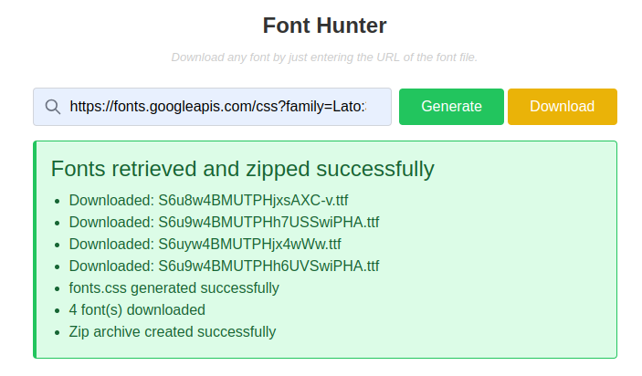

# Laravel Widget Package

A Laravel package for building and bundling reusable UI widgets as Blade components.

## Overview

`laravel-widget` is a Laravel package designed to manage a collection of UI widgets that can be easily embedded into any Laravel Blade view. The package simplifies widget integration while maintaining a clean, modern interface.  

The package currently includes its first widget: **Font Hunter** — a utility to download Google Fonts and their CSS files via a simple form.

---

## Features

- **Widget Bundle Ready**: Designed to host multiple widgets under one package.
- **Reusable Blade Components**: Easily embed widgets using Blade components.
- **Customizable Configurations**: Control storage paths, file names, and other settings.

---

## Requirements

- PHP 8.0 or higher  
- Laravel 9.x or 10.x  
- Writable storage directory (`storage/app/public`)

---

## Installation

1. **Install via Composer**

If published to a repository:
```bash
composer require souravmsh/laravel-widget
```

If developing locally:

```bash
// Add to composer.json
"repositories": [
    {
        "type": "path",
        "url": "packages/souravmsh/laravel-widget"
    }
]
composer require souravmsh/laravel-widget:dev-main
```

2. **Publish Configuration & Views**

   ```bash
   php artisan vendor:publish --tag=config
   php artisan vendor:publish --tag=views
   ```

3. **Set Storage Permissions**

   ```bash
   chmod -R 775 storage
   php artisan storage:link
   ```

---

## Usage

### 1. Font Hunter Widget

**Font Hunter Widget** is a Laravel package that provides a reusable, interactive Blade component for downloading Google Fonts and their associated CSS files. 
With a modern, Tailwind CSS-powered interface, users can simply input a Google Fonts CSS URL, fetch the font files, generate a custom CSS, and download everything as a convenient zip archive.




Designed as a plug-and-play widget, it integrates seamlessly into any Laravel Blade view via:


```blade
<x-laravel-widget::font-hunter />
```
or 
```blade
<x-laravel-widget::font-hunter 
    title="Font Hunter" 
    description="Download any font by entering the URL of the font file."
/>
```

### Workflow

1. Enter a valid Google Fonts CSS URL (example: `https://fonts.googleapis.com/css?family=Lato:300,400,700`).
2. Click **Generate** to fetch the fonts and CSS.
3. A **Download** button appears to download a zip archive containing the fonts and a generated CSS file.

---

## Configuration

Customize the package settings in `config/laravel-widget.php`:

```php

return [

    'middleware' => ['web'], // Middleware for the route
    'url_prefix' => 'laravel-widget', // URL prefix for the route

    // font hunter 
    "font_hunter" => [
        'dir'        => 'laravel-widget/font-hunter', // Base directory for storing files
        'fonts_dir'  => 'fonts', // Subdirectory for font files
        'css_dir'    => 'css', // Subdirectory for CSS files
        'file_name'  => 'fonts.css', // Name of the CSS file
    ]  
];
```

You can adjust:

* The base storage path
* Subdirectories for fonts and CSS
* Default CSS filename

---

## Customization

* **Styling**: To modify the widget’s appearance, edit `resources/views/vendor/laravel-widget/components/font-hunter.blade.php`.
* **Form Handling**: Optionally convert the form to AJAX-based by adding your custom JS.
* **Additional Widgets**: Future widgets can be added by creating new Blade components within this package.

---

## Notes

* Files are stored at `storage/app/public/laravel-widget/`. Ensure this directory is writable.
* The package uses a minimal POST route `/laravel-widget/process` to handle form submissions.
* Fully compatible with Laravel 9.x and 10.x.

---

## License

This package is open-source software licensed under the [MIT license](https://opensource.org/licenses/MIT).

--- 

## Support

For issues or feature requests, open an issue on the [GitHub repository](https://github.com/souravmsh/laravel-widget).

